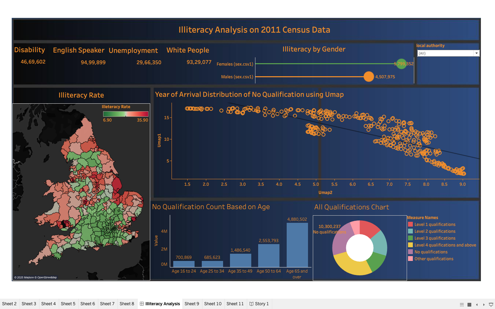
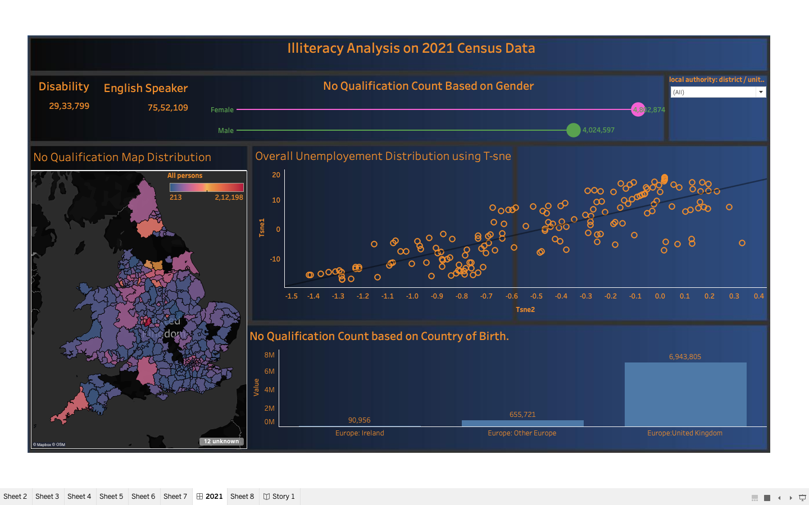
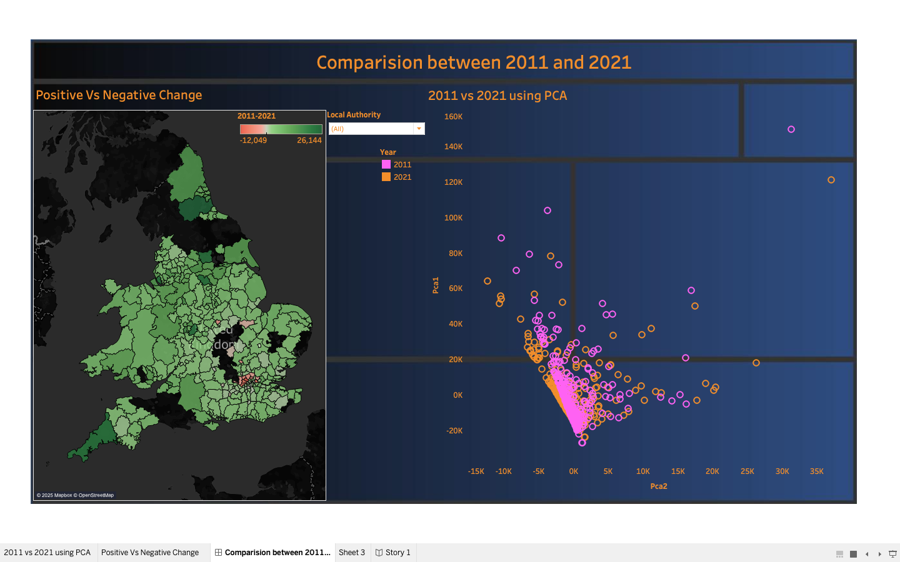

# 📊 Illiteracy Analysis using 2011 & 2021 Census Data

This project presents a comprehensive **visual analytics study of illiteracy trends in England and Wales**, using census data from **2011 and 2021**. The analysis utilizes techniques like **UMAP**, **t-SNE**, and **PCA** to explore correlations between illiteracy and socio-economic factors such as unemployment, gender, disability, immigration patterns, and educational attainment.

---

## 🎯 Objectives

- Understand changes in illiteracy trends over time
- Explore regional disparities across the UK
- Identify socio-economic and demographic correlates of illiteracy
- Communicate complex patterns through **interactive dashboards** using **Tableau**

---

## 📁 Project Structure

```
├── VA_report.pdf                     # Full report with findings and methodology
├── Dashboard1.png                    # 2011 census dashboard
├── Dashboard2.png                    # 2021 census dashboard
├── Dashboard3.0.png                  # Comparative dashboard (2011 vs 2021)
├── 2011_dash_new.twbx                # Tableau workbook for 2011
├── Dash_2021_New.twbx                # Tableau workbook for 2021
├── 2011_and_2021_New.twbx           # Combined workbook for comparison
```

---

## 🗂️ Data Source

- **2011 & 2021 UK Census Datasets**
  - Local authority-wise data on:
    - Literacy and qualifications
    - Disability
    - English language proficiency
    - Immigration (Year of Arrival)
    - Country of Birth
    - Gender and Age Distributions

- Data cleaned using **Excel & Python**, validated for structure, consistency, and numeric precision.

---

## 📊 Key Visualizations

### 1. Illiteracy in 2011

- Choropleth map showing illiteracy by region
- UMAP for immigration-based no-qualification trends
- Age-wise bar chart and donut chart of qualification levels

### 2. Illiteracy in 2021

- Choropleth map with updated qualification data
- t-SNE on unemployment vs no qualification
- Country of birth distribution for unqualified individuals

### 3. Comparative Analysis (2011 vs 2021)

- PCA showing temporal trends in literacy
- Change map for no-qualification shifts across regions

---

## 📈 Techniques Used

- **UMAP (Uniform Manifold Approximation & Projection)**: To analyze year-of-arrival vs qualification trends
- **t-SNE (T-distributed Stochastic Neighbor Embedding)**: To visualize unemployment distribution
- **PCA (Principal Component Analysis)**: To compare 2011 vs 2021 qualification patterns
- **Choropleth Maps**: Regional distribution of illiteracy rates
- **Lollipop & Donut Charts**: Gender and qualification breakdowns

---

## 🏙️ Special Case Study: Birmingham

Across all dashboards, **Birmingham consistently exhibits one of the highest illiteracy rates**, driven by:
- High immigration with lower qualification sectors (e.g., construction)
- Elevated unemployment among unqualified individuals
- Higher absolute counts of disabled and unqualified residents

---

## 📌 Insights

- **Demographic patterns**: Older adults and females show higher illiteracy in certain regions
- **Regional shifts**: Some areas improved literacy rates (2011→2021), others worsened
- **Immigration & Employment**: Regions with high recent immigration showed stronger illiteracy correlations
- **Policy Impact Zones**: Areas like Brent and Birmingham require targeted interventions

---

## 💻 Tools Used

- **Tableau**: Interactive dashboarding and storytelling
- **Python (Pandas, NumPy)**: Preprocessing, CSV validation
- **Excel**: Initial data restructuring and cleanup

---

## 📚 References

- UK Census 2011 and 2021 datasets
- Munzner, T. *Visualization Analysis and Design*
- UMAP, t-SNE, and PCA documentation
- Feedback from usability evaluations and user studies

---

## 🧪 Evaluation & Validation

- ✔️ **Testbed Evaluations**: Users found maps and bar charts intuitive
- ✔️ **Controlled Experiments**: PCA better for trend analysis; maps better for comparisons
- ✔️ **Field Studies**: Stakeholders made informed decisions using visual KPIs and patterns

---

## 👤 Author

**Uchit Bhadauriya**  
MSc Data Science – University of Bristol  
📧 ir23063@bristol.ac.uk  
🔗 [LinkedIn](https://www.linkedin.com/in/uchit-bhadauriya-a96478204)

---

⭐️ *Star this repo if you found it useful. Contributions, feedback, and forks are welcome!*
